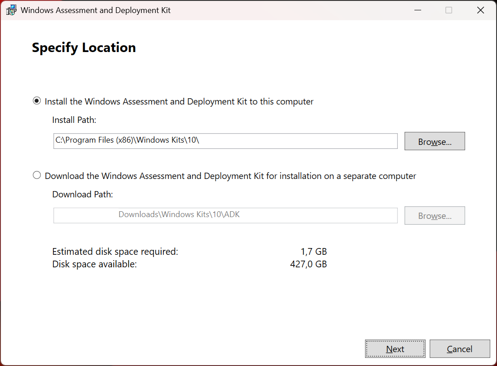
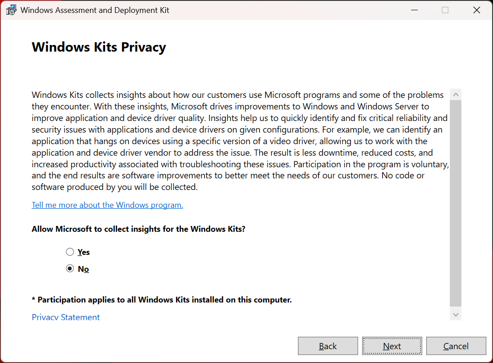
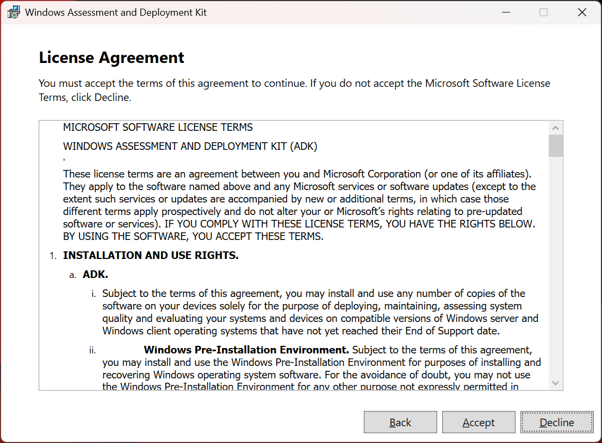
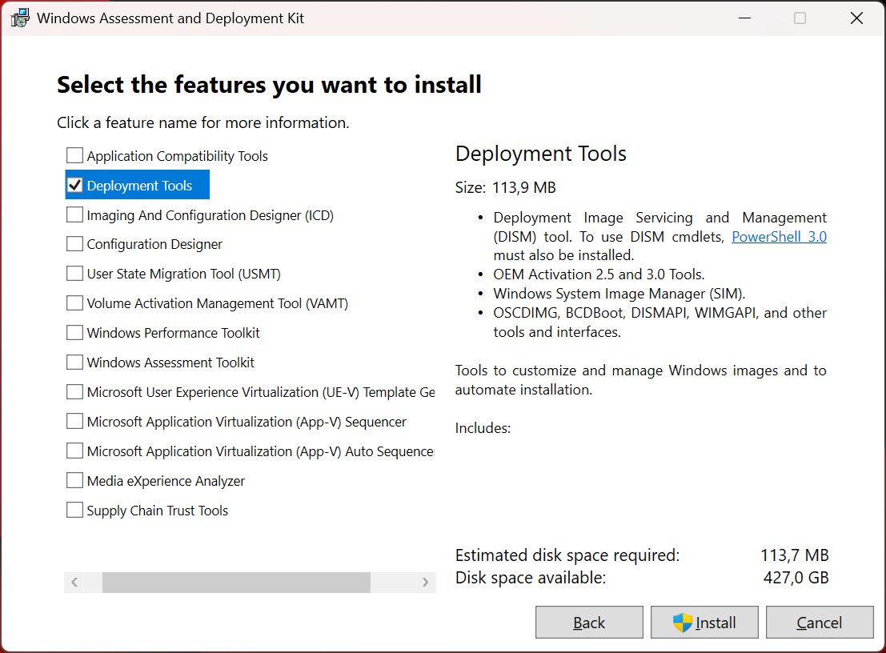

# How to install Windows ADK

1. Navigate to the [Download and install the Windows ADK](https://learn.microsoft.com/en-us/windows-hardware/get-started/adk-install) website.

2. Download only the *Windows ADK* (*Windows PE add-on* is not needed).  
    <sup>Please ignore that I reused the picture where I included the PE add-on in the red rectangle.</sup>

    [](./images/windows_adk/Download.png)

3. Start the Windows ADK setup (adksetup.exe), use the default settings,  
    and install only the *Deployment Tools* feature in the fourth step.

    [](./images/windows_adk/Step_1.png)
    [](./images/windows_adk/Step_2.png)
    [](./images/windows_adk/Step_3.png)
    [](./images/windows_adk/Step_4.png)
    [](./images/windows_adk/Step_5.png)

4. The installation is finished at this point, but you can verify that everything went well by
    checking if the `dism.exe` exists in the right place, assuming you installed Windows ADK to the default path.

    ```
    C:\Program Files (x86)\Windows Kits\10\Assessment and Deployment Kit\Deployment Tools\amd64\DISM\dism.exe
    ```
