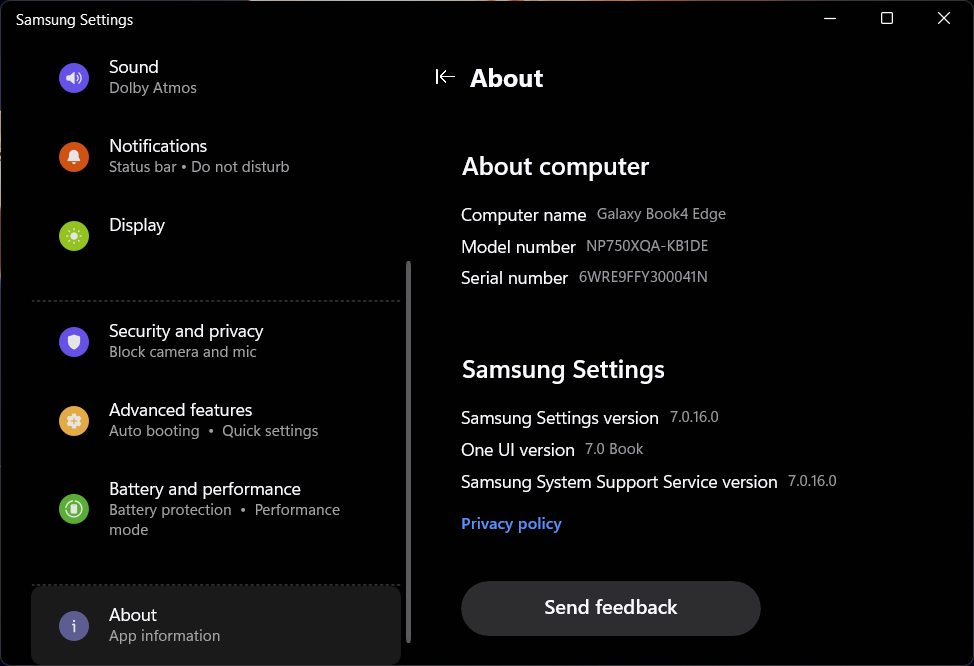
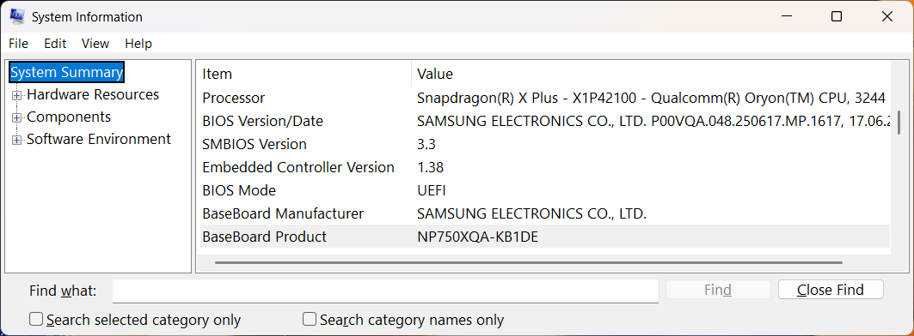
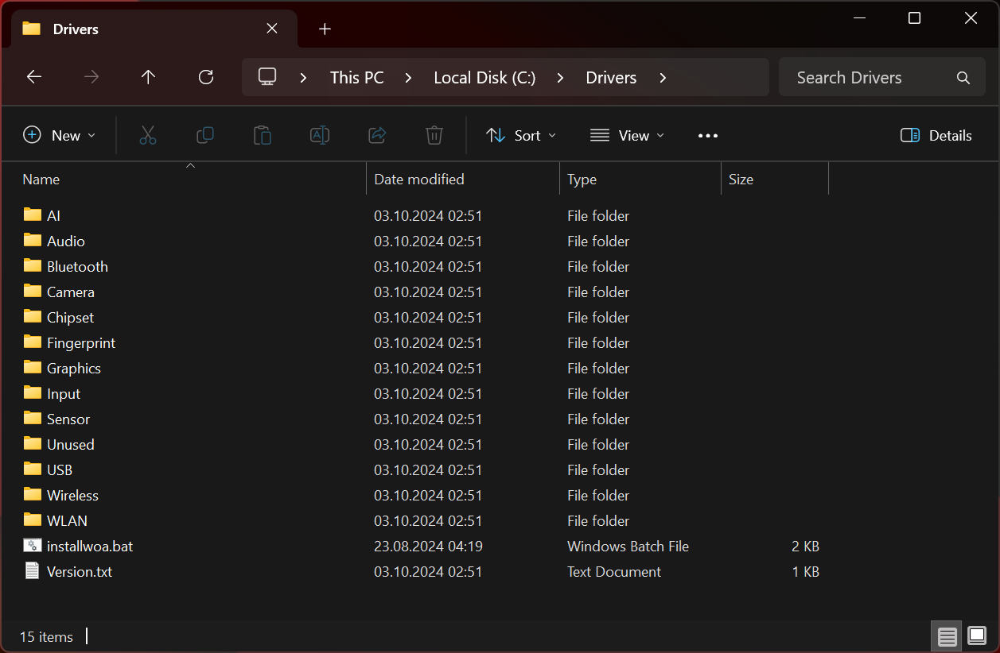

# Driver Pack for Windows

This document describes how to obtain a driver pack for your Samsung device, to create a bootable USB flash drive with drivers preinstalled later. I personally recommend grabbing the driver pack from the [Samsung website](#use-the-driver-pack-from-qualcomm), but it's also not going to hurt you, if you create an additional driver pack directly on the target machine before you reset Windows on it.

## How to find the model number of your device

> [!NOTE]  
> This is not required if you want to create a manual driver pack.

- It's on the fine print on the back of your device, before the serial number.

- On the device, in the `Samsung Settings` application, on the `About` page, at the very top next to **Model number**.

    [](./images/driver_pack/SamsungSettingsAboutPage.png)

- On the device, in the `System Information` application (hit `CTRL+R`, type `msinfo32` and hit enter),  
    on the `System Summary` page. There you can find the model number next to **BaseBoard Product**.

    [](./images/driver_pack/SystemInformation.png)

- On the device, in the UEFI (hit your `F2` key at device start), aka. BIOS, click on `More System Information` on the `SysInfo` page. 
    There you can find the model number next to **BaseBoard Product**.

## Use the driver pack from Qualcomm

1. Navigate to the [Samsung Galaxy Books Download Centre](https://www.samsung.com/global/galaxybooks-downloadcenter/) website.

2. Switch to the country where you made the purchase at the top of the page.

    You might potentially **NOT** find your device, if the country does not match the origin of the device.

    [](./images/driver_pack/DownloadCenter_Step_1.png)

3. Select `Galaxy Book4 Edge` in the first dropdown selection,  
    and the specific model of your device in the second dropdown box.

    [](./images/driver_pack/DownloadCenter_Step_2.png)

4. Hit the button to select the device, and you should be redirected to the download page of your device.  
    In my case, this was the device [NP750XQA-KB1DE](https://www.samsung.com/global/galaxybooks-downloadcenter/model/?modelCode=NP750XQA-KB1DE&siteCode=de).

5. Download the **Qualcomm - Windows Driver Pack** file.

    [](./images/driver_pack/DownloadCenter_Step_3.png)

> [!CAUTION]  
> Do **NOT** download the *PE DriverPack*. It is **NOT** going to work. Do not waste your time like I did.

6. Extract the drivers to `C:\WinIso\DriverPack`  
    <sup>Create the directory, if does not exist</sup>

> [!WARNING]  
> You can use any directory path, but be aware that the instructions in the main tutorial assume the drivers can be found in `C:\WinIso\DriverPack`.

    [](./images/driver_pack/Drivers.png)

## Manually create a driver pack

These instructions must be executed on the target machine prior to the installation, and it's only possible if you can start and operate Windows on it. On a brand new device you can simply skip through the regular Windows installation - you can still [use an offline account](https://ss64.com/nt/syntax-oobe.html) on Windows 11 Home where the `oobe\bypassnro` script was removed.

The *dism command* to export drivers found 340 drivers on my target device.

1. Open *Command Prompt* as Administrator.  
    You can `Right-Click` on Start-Menu and click on `Terminal (Admin)`.

    [](./images/StartMenuTerminalAsAdmin.png)

2. Create a folder for the drivers:

    ```bat
    mkdir C:\Drivers
    ```

    You can use any directory path, but be aware that every instruction from now on assumes that the drivers can be found in `C:\Drivers`.

3. Export the drivers to that folder:

    ```bat
    dism /Online /Export-Driver /Destination:"C:\Drivers"
    ```

4. Copy the drivers folder `C:\Drivers` to a backup location, this can also be located on an external hard drive or a USB flash drive.
