# Installing Microsoft Windows on a Samsung Galaxy Book4 Edge

This elaborate tutorial guides you through the torturous process of installing the Microsoft Windows operating system on a [Samsung Galaxy Book4 Edge](https://www.samsung.com/us/computing/galaxy-books/galaxy-book4-edge/) with the [Snapdragon X Plus](https://www.qualcomm.com/products/mobile/snapdragon/laptops-and-tablets/snapdragon-x-plus) (X1P-42-100) central processing unit. This tutorial is probably also applicable to similiar devices with an ARM64 architecture cpu.

The information presented in this tutorial is primarily based on the work in the repository [Acercandr0/Snapdragon-X-Windows-ARM-reinstall](https://github.com/Acercandr0/Snapdragon-X-Windows-ARM-reinstall) by [Acercandr0](https://github.com/Acercandr0), and on the work in the GitHub Gist [caccialdo/article.adoc](https://gist.github.com/caccialdo/3b0d0113489ecee456d94c1e9462d755) by [caccialdo](https://github.com/caccialdo), including the comments by other users below that Gist.

> THIS TUTORIAL IS PROVIDED "AS IS", WITHOUT WARRANTY OF ANY KIND, EXPRESS OR IMPLIED, INCLUDING BUT NOT LIMITED TO THE WARRANTIES OF MERCHANTABILITY, FITNESS FOR A  PURPOSE AND NONINFRINGEMENT. IN NO EVENT SHALL THE AUTHORS OR COPYRIGHT HOLDERS BE LIABLE FOR ANY CLAIM, DAMAGES OR OTHER LIABILITY, WHETHER IN AN ACTION OF CONTRACT, TORT OR OTHERWISE, ARISING FROM, OUT OF OR IN CONNECTION WITH THIS TUTORIAL OR THE USE OR OTHER DEALINGS IN THIS TUTORIAL.

## Requirements

- A working x86_64/AMD64 computer with the Microsoft Windows operating system, or a virtual machine with Windows.

- 2x USB flash drive (each one should have at least 8 GB capacity, up to 32 GB due to FAT32 limitations on Windows)

> [!TIP]
> You can use a USB flash drive with a capacity over 32 GB, but you won't be able to use more than 32 GB for the FAT32 partition.

> [!IMPORTANT]
> It is of utmost importance that you can plug in both USB flash drives into the target device at the same time.  
> You can use a USB Hub to get around the port limitations of your device.

- Windows Driver Pack from Qualcomm

> [!IMPORTANT]
> You can either [download the driver pack from the Samsung website](#use-the-driver-pack-from-qualcomm) (**recommended**), or
> [manually create a backup of your drivers](#manually-create-a-driver-pack) on your device, and later use them.

- [Windows Assessment and Deployment Kit](https://learn.microsoft.com/en-us/windows-hardware/get-started/adk-install) (Windows ADK)

> [!IMPORTANT]
> Download and install the **Windows PE add-on for the Windows ADK** as well.

## Overview

1. [Grab a Windows Driver Pack](#how-to-create-a-driver-pack)
2. [Install Windows ADK and PE add-on](#how-to-install-windows-adk)
3. [Create a USB drive with Windows Preinstallation Environment (WinPE)](#how-to-create-a-windows-pe-boot-device)
4. [Create a USB drive with Windows installation files](#how-to-create-a-windows-installation-files-device)
5. [Boot into WinPE and run the included scripts](#booting-into-windows-pe-and-hard-drive-preparations)
6. [Reboot and run through the regular Windows installation](#final-steps)

## How to create a driver pack

You need a single driver pack for the steps that follow after this section, and I personally recommend grabbing the driver pack from the Samsung website, as described in the [first section](#use-the-driver-pack-from-qualcomm), but it's also not going to hurt you, if you create an additional driver pack directly on the target machine before you reset Windows on it.

### Use the driver pack from Qualcomm

Shortcut: [Samsung Galaxy Books Download Centre](https://www.samsung.com/global/galaxybooks-downloadcenter/)

<details>
<summary>How to find the model number of your device.</summary>

- It's on the fine print on the back of your device, before the serial number.

- On the device, in the `Samsung Settings` application, on the `About` page, at the very top next to **Model number**.

    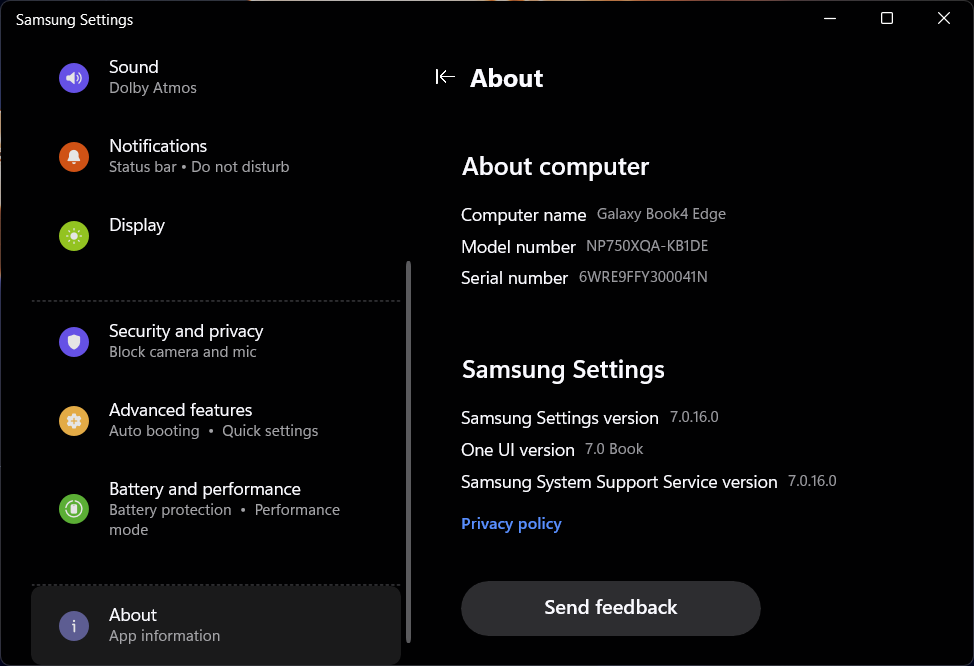

- On the device, in the `System Information` application (hit `CTRL+R`, type `msinfo32` and hit enter), on the `System Summary` page.  
    There you can find the model number next to **BaseBoard Product**.

    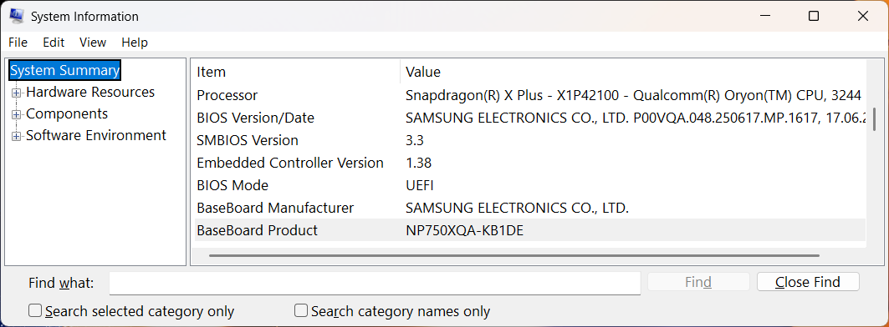

- On the device, in the UEFI (hit your `F2` key at device start), aka. BIOS, click on `More System Information` on the `SysInfo` page.  
    There you can find the model number next to **BaseBoard Product**.
</details>

<details>
<summary>Reveal the download instructions</summary>

1. Navigate to the [Samsung Galaxy Books Download Centre](https://www.samsung.com/global/galaxybooks-downloadcenter/) website.

2. Switch to the country where you made the purchase at the top of the page.
    > [!IMPORTANT]
    > You might potentially **NOT** find your device, if the country does not match the origin of the device.

    
3. Select `Galaxy Book4 Edge` in the first dropdown selection,  
    and the specific model of your device in the second dropdown box.

    

4. Hit the button to select the device, and you should be redirected to the download page of your device.
    In my case, this was the device [NP750XQA-KB1DE](https://www.samsung.com/global/galaxybooks-downloadcenter/model/?modelCode=NP750XQA-KB1DE&siteCode=de).

5. Download the **Qualcomm - Windows Driver Pack** file.

    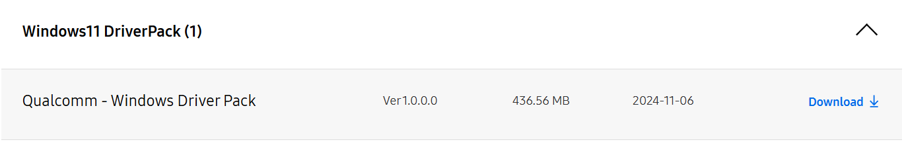

    > [!CAUTION]
    > Do **NOT** download the *PE DriverPack*. It is **NOT** going to work. Do not waste your time like I did.

6. Extract the drivers to `C:\Drivers`. Create this directory, if it doesn't exist yet.
    > [!NOTE]
    > You can use any directory path, but be aware that every instructions from now on assumes the drivers can be found in `C:\Drivers`.

    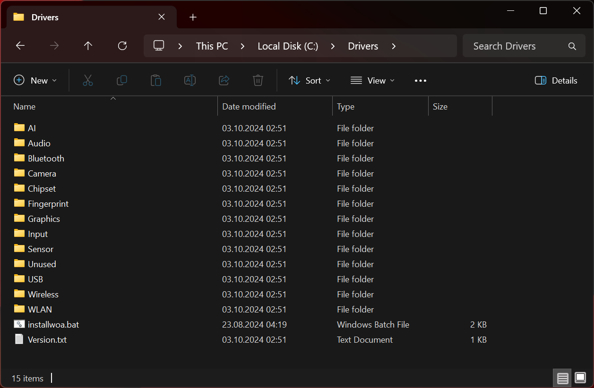
</details>

### Manually create a driver pack

<details>
<summary>Reveal the instructions</summary>

These instructions must be executed on the target machine prior to the installation, and it's only possible if you can start and operate Windows on it. On a brand new device you can simply skip through the regular Windows installation - you can still [use an offline account](https://ss64.com/nt/syntax-oobe.html) on Windows 11 Home where the `oobe\bypassnro` script was removed.

The *dism command* to export drivers found 340 drivers on my target device.

1. Open *Command Prompt* as Administrator.  
    You can `Right-Click` on Start-Menu and click on `Terminal (Admin)`.

    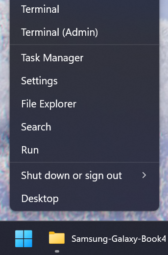

2. Create a folder for the drivers:

    ```bat
    mkdir C:\Drivers
    ```

    > [!NOTE]
    > You can use any directory path, but be aware that every instructions from now on assumes the drivers can be found in `C:\Drivers`.

3. Export the drivers to that folder:

    ```bat
    dism /Online /Export-Driver /Destination:"C:\Drivers"
    ```

4. Copy the drivers folder `C:\Drivers` to a backup location,  
    this can also be located on an external hard drive or USB flash drive.
</details>

## How to install Windows ADK

<details>
<summary>Reveal the install instructions</summary>

1. Navigate to the [Download and install the Windows ADK](https://learn.microsoft.com/en-us/windows-hardware/get-started/adk-install) website.

2. Scroll down to the first download section,  
    in my case this was `Download the ADK 10.1.26100.2454 (December 2024)`.

3. Download **both** the *Windows ADK* **and** the *Windows PE add-on*.

    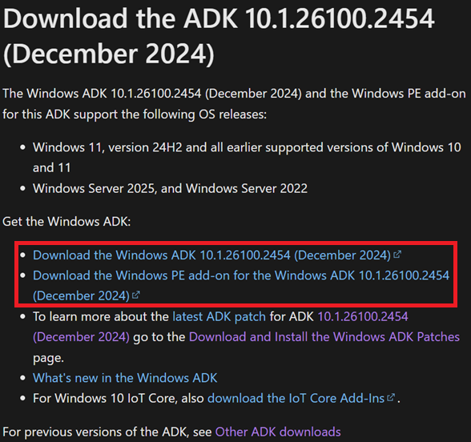

4. Start the Windows ADK setup (adksetup.exe) first, use the default settings,  
    and install only the *Deployment Tools* feature in the fourth step.

    <details>
    <summary>Reveal the install steps pictures</summary>

    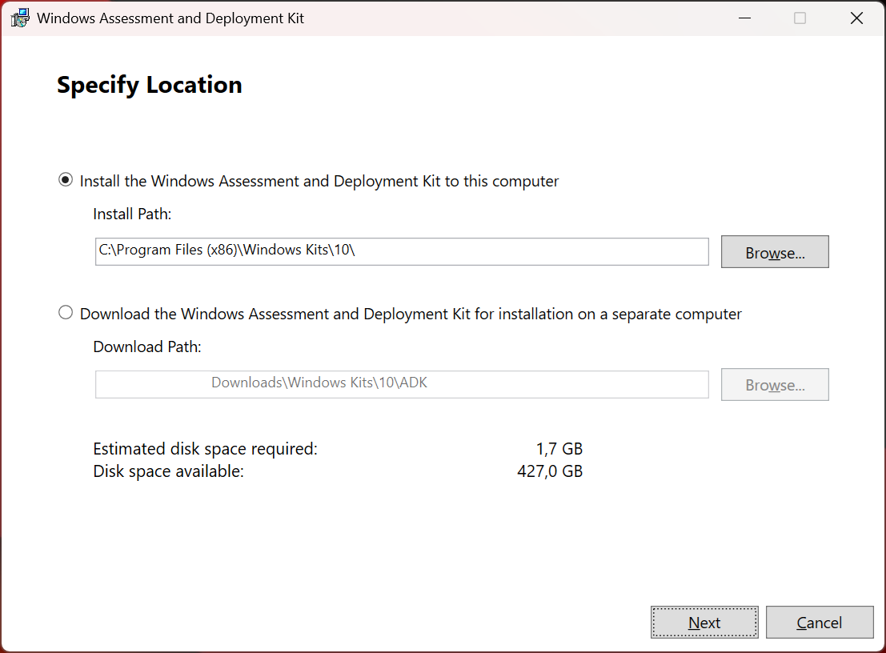
    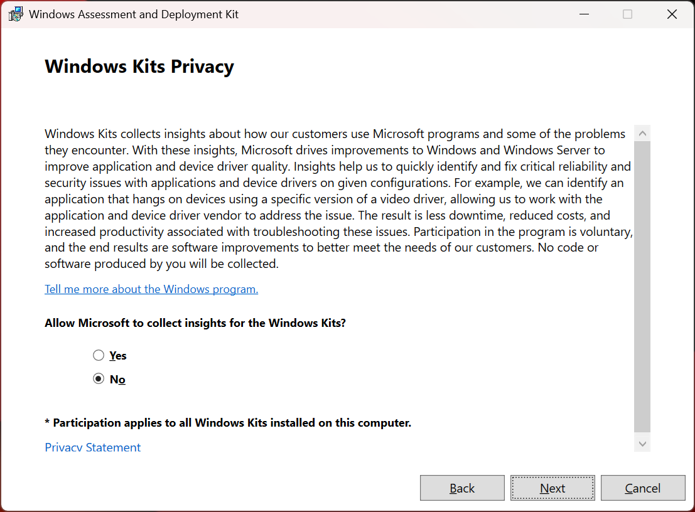
    
    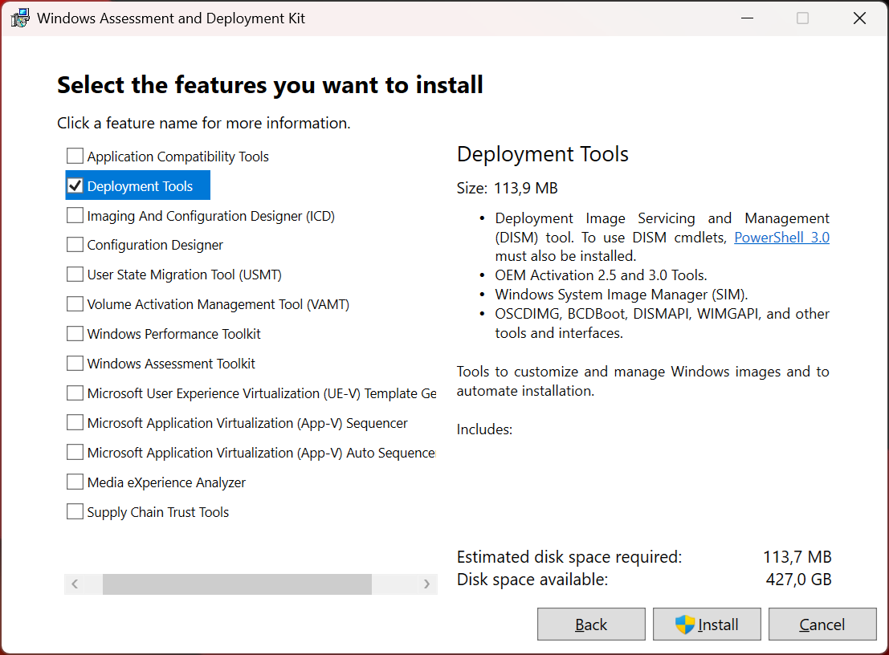
    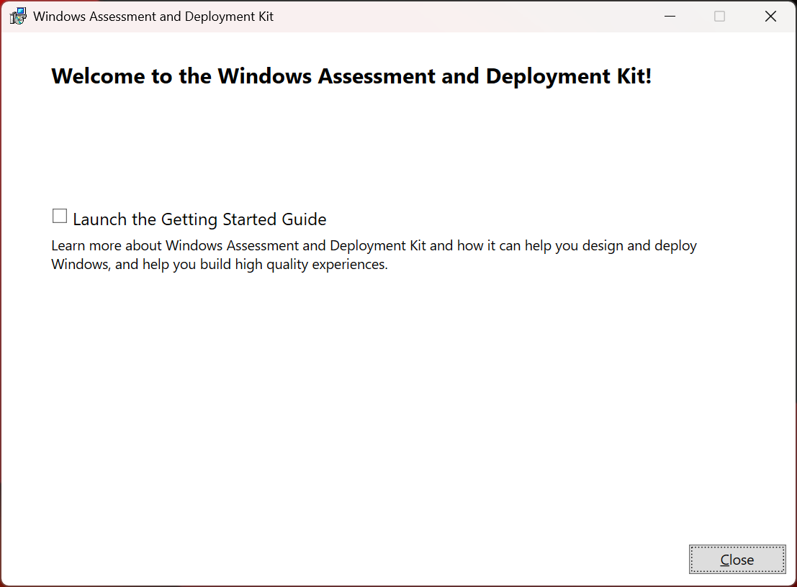
    </details>

5. Start the Windows PE add-on setup (adkwinpesetup.exe) second, and use the default settings.

    <details>
    <summary>Reveal the install steps pictures</summary>

    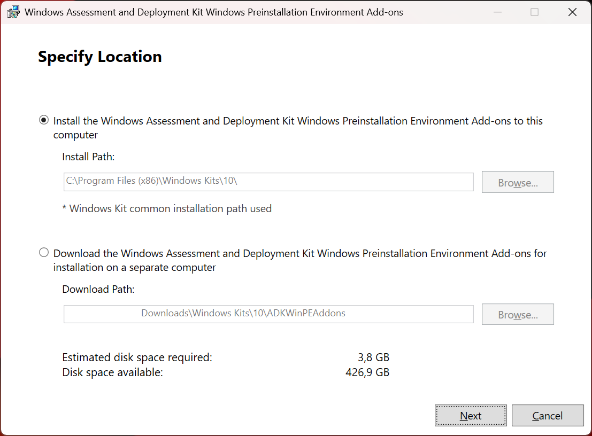
    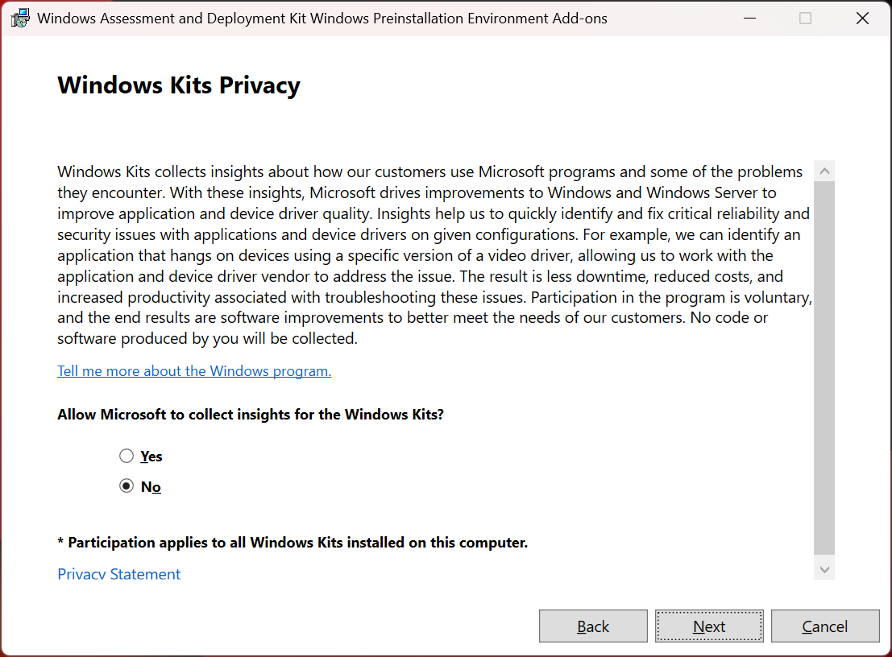
    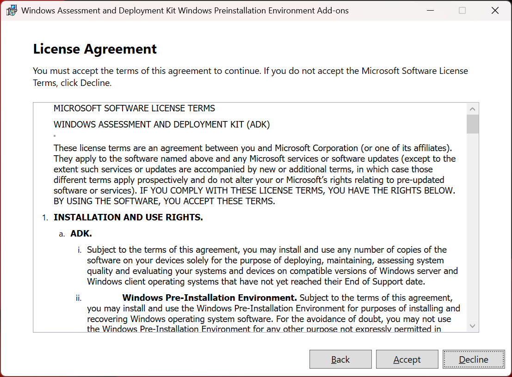
    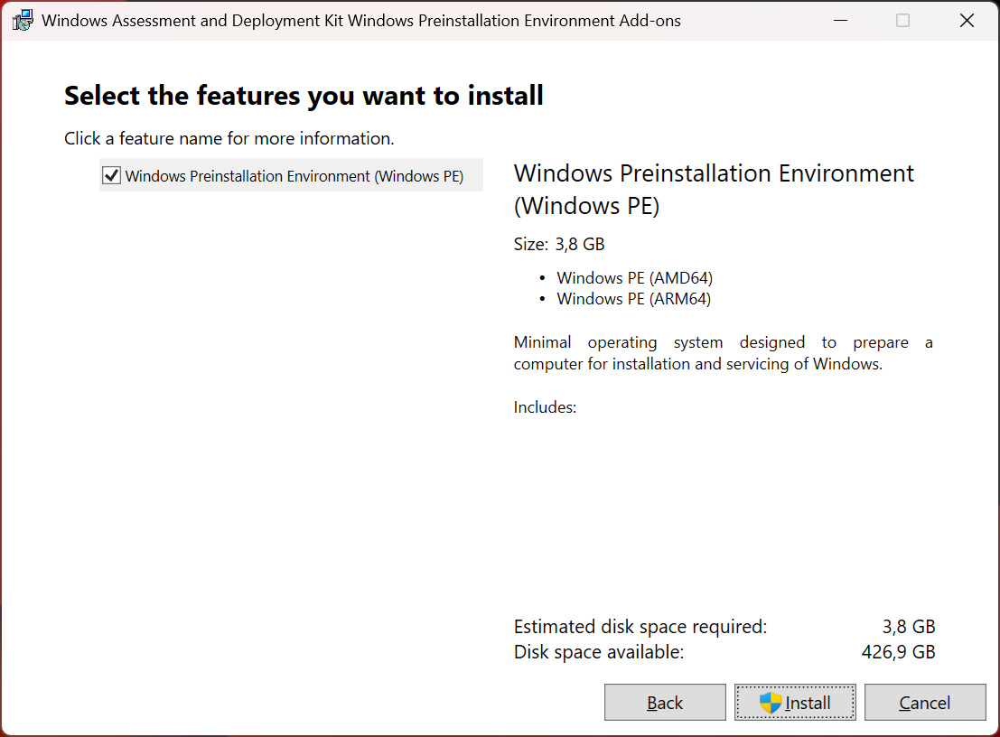
    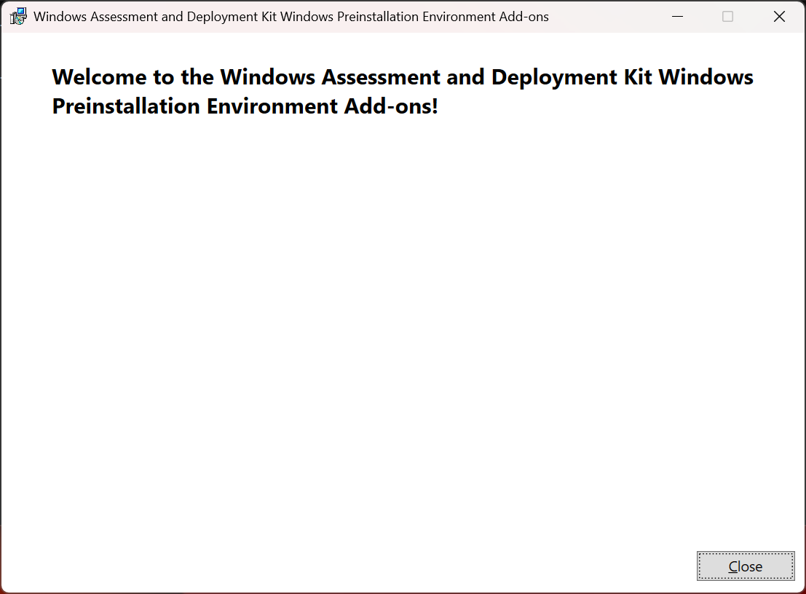
    </details>

6. The installation is finished at this point, but you can verify that everything went well by
    checking if the `dism.exe` exists in the right place, assuming you installed Windows ADK to the default path.
    You will run into issues with the `copype` command later, if this executable does not exist.

    ```
    C:\Program Files (x86)\Windows Kits\10\Assessment and Deployment Kit\Deployment Tools\amd64\DISM\dism.exe
    ```

</details>

# How to create a Windows PE boot device

1. Start `Deployment and Imaging Tools Environment` as Administrator

    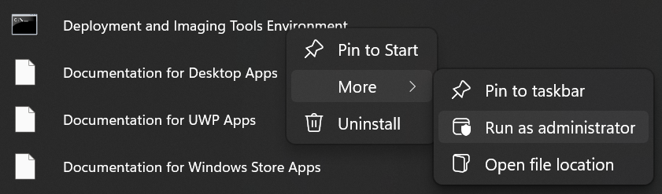

    If you struggle to find this shortcut, you may as well run the command behind it:
    ```bat
    cmd.exe /k "C:\Program Files (x86)\Windows Kits\10\Assessment and Deployment Kit\Deployment Tools\DandISetEnv.bat" 
    ```

2. Switch to the Windows PE subdirectory
    ```bat
    cd "..\Windows Preinstallation Environment\amd64"
    ```
    If you receive `The system cannot find the path specified` at this step, then go back and [install the Windows ADK PE add-on](#how-to-install-windows-adk).

3. Ensure `C:\WinPE` does not exist on your hard drive

4. Run `copype arm64 C:\WinPE`

    > [!NOTE]
    > You can use any output directory path, but make sure to fix the paths in the commands below, if you change it.

5. Mount the WinPE installation medium.

    ```bat
    dism /Mount-Image /ImageFile:"en-us\winpe.wim" /Index:1 /MountDir:"C:\WinPE\mount"
    ```

    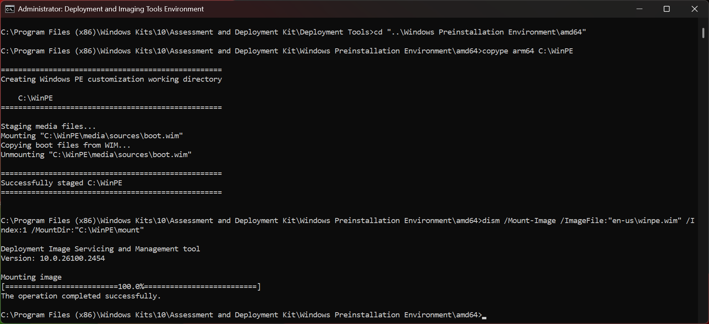

6. Install the drivers from [your driver pack](#how-to-create-a-driver-pack).  
    <sup>We assume that your driver pack is located at `C:\Drivers`. Change the path if you placed the files anywhere else.</sup>

    ```bat
    dism /Image:"C:\WinPE\mount" /Add-Driver /Driver:"C:\Drivers" /Recurse
    ```

    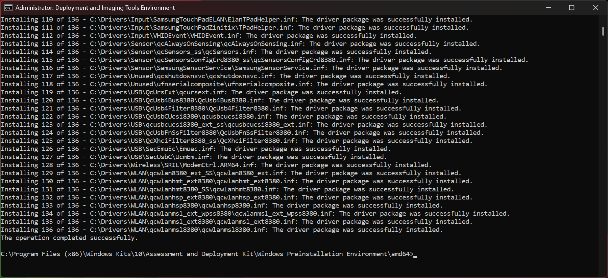

7. Create a bootable USB flash drive with WinPE.

    - Flash your USB flash drive directly and automated:

        ```bat
        MakeWinPEMedia /UFD C:\WinPE E:
        ```

        This command may fail if your target device is not formatted correctly.  
        But do not worry, because there is a solution on [MSDN](https://learn.microsoft.com/en-us/archive/msdn-technet-forums/541095fd-b1b9-4143-8c64-71f9e932bec4):

        ```bat
        diskpart
        list disk
        select disk x
        clean
        convert MBR
        create partition primary
        format fs=fat32 quick label="WINPE"
        assign letter "x"
        exit
        ```

        > [!NOTE]
        > The second command `list disk` is going to show you the available disks on your device,
        > and you must to select the USB flash drive disk in the next command, e.g. `select disk 3`.

        > [!IMPORTANT]
        > If your USB flash drive is too large for FAT32, then use the command `create partition primary size=30000`,  
        > but be aware that this will obviously limit your partition to around 30 GB.

    - Create an ISO file and manually flash the USB flash drive:

        ```bat
        MakeWinPEMedia /ISO C:\WinPE C:\WinPE.iso
        ```

        Use a program like [Rufus](https://rufus.ie/en/) to create the bootable USB drive using the new ISO file.

8. Commit the changes to `en-us\winpe.wim` and unmount the image.

    ```bat
    dism /Unmount-Image /MountDir:"C:\WinPE\mount" /Commit
    ```

    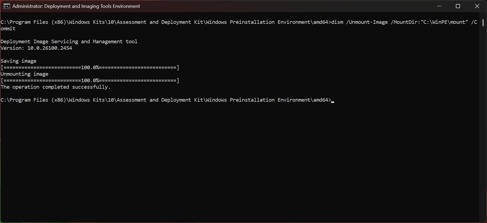

9. Done

# How to create a Windows installation files device

1. Obtain a Windows installation medium.

    - [Microsoft: Download Windows 11 for Arm-based PCs](https://www.microsoft.com/en-gb/software-download/windows11arm64)  
        <sup>Official download from Microsoft for Windows 11 Arm64.</sup>
    - [UUP dump: Latest Public Release build](https://uupdump.net/fetchupd.php?arch=arm64&ring=retail)  
        <sup>Latest updated build for regular users.</sup>
    - [UUP dump: Latest Release Preview build](https://uupdump.net/fetchupd.php?arch=arm64&ring=retail)  
        <sup>Reliable builds for previewing the next release. Ideal for trying out upcoming releases.</sup>
    - [UUP dump: Latest Beta Channel build](https://uupdump.net/fetchupd.php?arch=arm64&ring=retail)  
        <sup>Reliable builds with most upcoming features available. Ideal for early adopters.</sup>
    - [UUP dump: Latest Dev Channel build](https://uupdump.net/fetchupd.php?arch=arm64&ring=retail)  
        <sup>Somewhat unreliable builds with new ideas and long lead features. Ideal for enthusiasts.</sup>
    - [UUP dump: Latest Canary Channel build](https://uupdump.net/fetchupd.php?arch=arm64&ring=retail)  
        <sup>Somewhat unstable builds with latest platform changes and early features. Ideal for highly technical users.</sup>
    - [archive.isdn.network](https://archive.isdn.network/artifacts/)  
        <sup>Here you can find the Windows 11 IoT Enterprise LTSC 2024 for Arm64, and other *.iso files.</sup>
    - [macOS: CrystalFetch](https://github.com/TuringSoftware/CrystalFetch)  
        <sup>macOS UI for creating Windows installer ISO from UUPDump.</sup>

2. Create the `C:\WinDrive` directory on your hard drive.

    > [!NOTE]
    > You can use any directory path, but make sure to fix the paths in the commands below, if you change it.

3. Extract the `install.wim` file to `C:\WinDrive\install.wim`.

    There are two easy ways to accomplish this task:

    - Right-click on the Windows ISO file, and then mount it. You can also use `Open with > Windows Explorer` for this.  
        Navigate to the mounted image, and then locate the `install.wim` file within.  
        You can most likely find it stored as `sources\install.wim` (should be at least 2 GB or more).  
        Then copy that file to `C:\WinDrive\install.wim`.

    - Open the Windows ISO file using the [7-Zip File Manager](https://www.7-zip.org/), and locate the `install.wim` file within.  
        You can most likely find it stored as `sources\install.wim` (should be at least 2 GB or more).  
        Then extract that file to `C:\WinDrive\install.wim` (you can drag-and-drop it).

4. Open *Command Prompt* as Administrator.  
    You can `Right-Click` on Start-Menu and click on `Terminal (Admin)`.

    

5. Switch to the `C:\WinDrive` directory.

    ```bat
    cd C:\WinDrive
    ```

6. Create the `mount` subdirectory.

    ```bat
    mkdir mount
    ```

7. Mount the `install.wim` file.

    ```bat
    dism /Mount-Image /ImageFile:"install.wim" /Index:1 /MountDir:"C:\WinDrive\mount"
    ```

8. Install the drivers from [your driver pack](#how-to-create-a-driver-pack).  
    <sup>We assume that your driver pack is located at `C:\Drivers`. Change the path if you placed the files anywhere else.</sup>

    ```bat
    dism /Image:"C:\WinDrive\mount" /Add-Driver /Driver:"C:\Drivers" /Recurse
    ```

9. Commit the changes to `install.wim` and unmount the image.

    ```bat
    dism /Unmount-Image /MountDir:"C:\WinDrive\mount" /Commit
    ```

10. Split the `install.wim` file, if it's above 4 GB (4,294,967,295 bytes).

    > [!IMPORTANT]
    > This is really only necessary, if your `install.wim`+drivers exceeds the 4 GB maximum file size of FAT32.

    ```bat
    dism /Split-Image /ImageFile:"C:\WinDrive\install.wim" /SWMFile:"C:\WinDrive\install.swm" /FileSize:3800
    ```

11. Format the second USB flash drive as FAT32.

    > [!IMPORTANT]
    > Do not overwrite your USB flash drive with WinPE on it. Use the second USB flash drive for this.

12. Copy the installation medium to the second USB flash drive.

    - If you've split the image, then copy all `install*.swm` files and ignore the `install.wim` file,
    - Otherwise, copy the `install.wim` file.

13. Copy [CreatePartitions.txt](./CreatePartitions.txt) and [ApplyImage.bat](./ApplyImage.bat) to the second USB flash drive.

    *CreatePartitions.txt* is a script for *diskpart*, which will erase and properly set up all partitions on disk 0, and assign drive letters.  
    *ApplyImage.bat* is a batch script, which applies a `install.wim` to the drives set up by *CreatePartitions.txt*.  

    *CreatePartitions.txt* and *ApplyImage.bat* were copied from https://gist.github.com/caccialdo/3b0d0113489ecee456d94c1e9462d755, and these scripts were adapted from original code by Microsoft ([1](https://learn.microsoft.com/en-us/previous-versions/windows/it-pro/windows-8.1-and-8/hh825686(v=win.10)), [2](https://learn.microsoft.com/en-us/previous-versions/windows/it-pro/windows-8.1-and-8/hh825089(v=win.10))).

14. Your second USB flash drive is ready, you can now eject it.

# Booting into Windows PE and hard drive preparations

1. Power off your target computer.

2. Plug in both USB flash drives, and other devices like a mouse and a keyboard, if you insist.

3. Power on the computer and switch to the UEFI/BIOS menu by repeatedly hitting F2 when you see the Samsung boot logo.

    > [!TIP]
    > If your device keeps booting into Windows, then there is another way to enter the UEFI menu:
    > - Open your start menu
    > - Click on the power icon
    > - Hold the `Shift` key and click on `Reboot`
    > - Wait until your device reboots into the blue troubleshooting menu.
    > - Use arrow keys to select `Troubleshoot` (*Reset your PC or see advanced options*) and then hit enter key.
    > - Select `Advanced options` and then hit enter key.
    > - Select `UEFI Firmware Settings` and then hit enter key.
    > - Hit enter again to reboot

4. Once you're inside the UEFI menu, you should disable Secure Boot and boot the WinPE USB flash drive first:

    - Switch to the `Boot` menu
    - **Disable** Secure Boot Control
    - Click on `Boot Device Priority >`
    - Select your WinPE USB flash drive next to `Boot Option #1`
    - Hit the *Save* button on the right side
    - Confirm the changes by hitting *OK*

5. Your device should boot into the Windows Preinstallation Environment now.  
    You should see a command prompt on a plain blue background.

6. Identify your second USB flash drive with the Windows installation medium files.  
    You need the volume **Ltr** for the steps below.

    ```bat
    echo 'list volume' | diskpart
    ```
    Or alternatively:
    ```bat
    diskpart
    list volume
    exit
    ```

    In this example you can observe that our files are potentially located on `D:\`.
    ```
    Volume ###  Ltr  Label        Fs     Type        Size     Status     Info
    ----------  ---  -----------  -----  ----------  -------  ---------  --------
    Volume 3     D   WINDOWS      FAT32  Removable   7677 MB  Healthy
    ```

    You check if the volume contains the installation files by running this command:
    ```bat
    dir D:\
    ```

    > [!IMPORTANT]
    > The remainder of these steps assume your second USB flash drive was mounted as `D:\`.

7. Erase the first disk and set up the partitions as required by the Windows operating system.  

    ```bat
    diskpart /s D:\CreatePartitions.txt
    ```

8. Combine the split installation medium.  
    This is only required if you've split the `install.wim` for the USB flash drive.  

    ```bat
    dism /Export-Image
         /DestinationImagePath:W:\install.wim
         /SourceImageFile:D:\install.swm
         /SourceIndex:1
         /SWMFile:D:\install*.swm
    ```

    > [!WARNING]
    > The *dism* command above must be written on a single line inside the command prompt within WinPE.
    > I have written it this way here so it's easier to read and copy.

9. Apply the installation medium to the new partitions.

    - If you're using a split installation medium then your combined *.wim is located on `W:\`
        ```bat
        D:\ApplyImage.bat W:\install.wim
        ```
    
    - Otherwise:
        ```bat
        D:\ApplyImage.bat D:\install.wim
        ```

10. Exit the Windows Preinstallation Environment.

    ```bat
    exit
    ```

11. Remove your USB flash drives while the computer restarts.

12. If everything went well, your device should now boot Windows 11.

13. Done. I hope you didn't have to waste hours on this.
